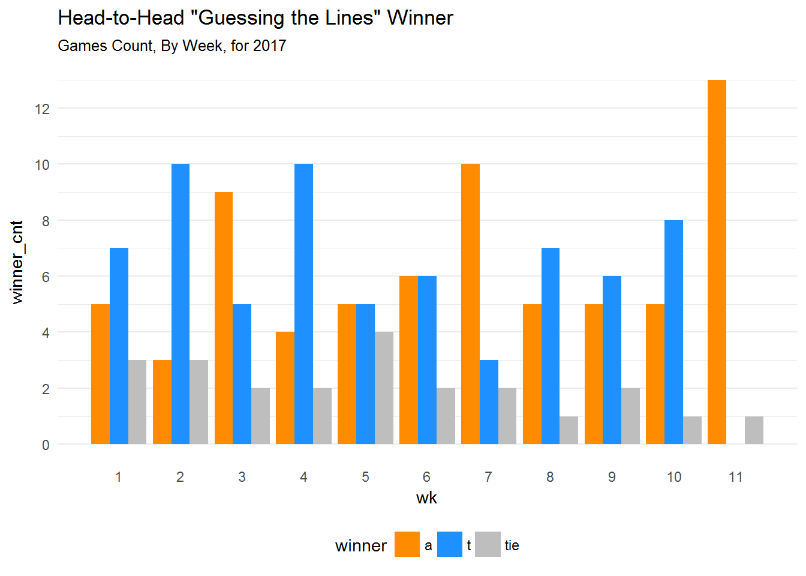
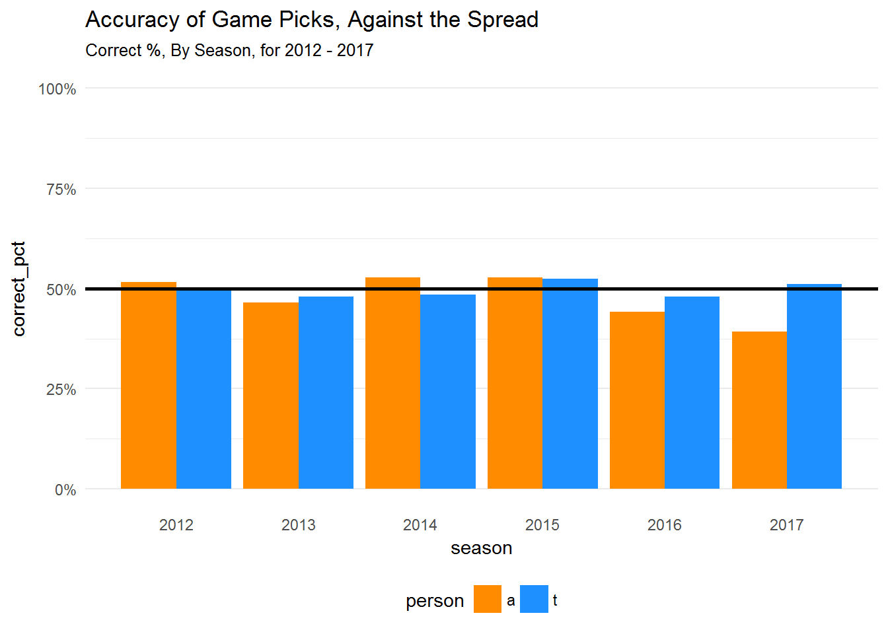

# Introduction

This project was initiated by my desire to create a weekly automated report
to send to my brother for the NFL picks that we do.
At the beginning of each week in the NFL season (including the playoffs),
we "guess the lines" to see which one of us is better
in gauging the betting market.
Thanks to sports media personality Bill Simmons (@BillSimmons) and
Jimmy Kimmel's "Cousin Sal"
(@TheCousinSal) for the original inspiration for this concept.
Additionally, we make picks for each game against the spread (ATS) and straight up.
A script that can send weekly updates as
new information is entered (manually) in my spreadsheet would be really cool.

The proof-of-concept phase of this project has been completed
(see the `output` folder in this repo),
including verification that the report can be sent via email (using the
`gmailr` package created by Jenny Bryan).
However, the scripts and actual implementation of the weekly updates has not been done.
I intend to come back to this project eventually...

# Highlights

Here are examples of two of the visualizations in the report. 
`t` is me (Tony) and `a` is my brother (Andrew).

# Notes to Self

I restructured this repo when cleaning it up for GitHub, so variables in the scripts
that reference other files may need to be updated.

